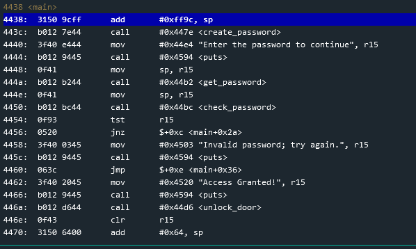
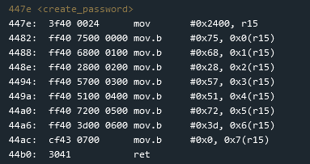
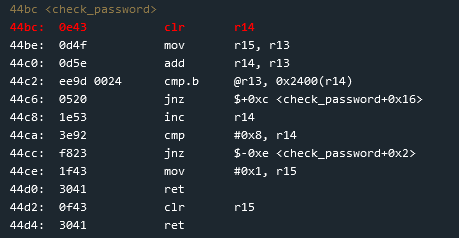
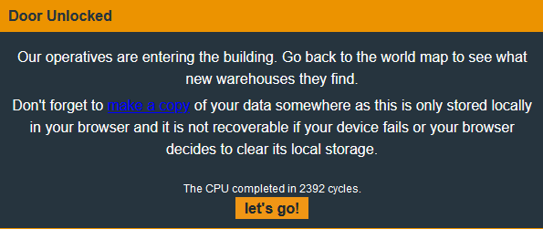

# Microcorruption Level #1 - New Orleans
This is the first level without having your hands held.
As soon as you start the challenge you are greeted with the following info popup:

#### First Steps
Quickly scrolling through the disassembly window we see a couple functions that stand out: create_password and check_password.
Without spending too much looking through them, lets set a breakpoint at main.
Enter 'c' into the Debugger Console to continue to the breakpoint.

The first instruction in the main function adds the hex value 'ff9c' to the sp register (sp was 4400) resulting in the value '439c' being placed in it. '439c' is placed into sp because when adding '4400' and '439c' in hex the result is '1439c' but that is too big to be stored into sp. To account for this bigger number sr is updated to '1' to reflect the overflow. and '439c' is placed into sp.
The next instruction then calls 'create_password'.

#### <create_password>

The first instruction moves the hex value '2400' into r15. The next instruction is 'mov.b'. After consulting reseaching online for the MSP430 instruction set, we can see that 'mov.b' moves a byte into the specified location. In this case the specified location is the value in r15 plus an offset. The offset is 0x0 and r15 = 2400, so the instrucation places the value '75' at address '2400'. The following instructions increment the offset by one and add their value to that location. After all the 'mov.b' instructions, the memory address '2400' looks like this:  

The characters at the right are the ASCII representations of the hex values. The last 'mov.b' instruction moves '00', which is a null terminator for a string. 

#### Thoughts so far
After looking at the 'create_password' function, we can see that values are being placed into memory followed by a null terminator. This could be a string that is compared to our password that we will enter, either it is filled with random characters to throw us off, the values will be modified later on and then compared, or that is the actual password.

#### Entering the password
After returning back to main the program moves text into r15 and then calls 'puts'. This prints the text 'Enter the password to continue' to the I/O Console. 'get_password' is then called and this gets the users input. Finally, check_password is called.

#### <check_password>

Right off the bat r14 gets cleared. r15 ('439c') gets copied into r13, and r14 ('0') gets added to r13 (still '439c'). We can see that the next instruction is the first 'cmp.b' in the program. Similar to 'mov.b' in that it only pertains to one byte, this instruction compares the two values. The first value is stored in memory at the address contained in r13 ('439c') and the second value is at memory address '2400' plus an offset of '0'. Following the compare we see a 'jnz' instruction. 'jnz' will jump only if sr is not 0. Since we did not enter the value at '2400' sr became '1' after the 'cmp.b' instruction. It then returns to main where a 'tst' instruction is performed. 'tst' checks to see if the specified value is equal to '0'. Since sr is not '0' We see an "Invalid password; try again." message.

#### Let's Assume

Before restarting the program to enter the value at '2400' lets take a look at the rest of the function. If we assume that we had entered the value at '2400' we can see that the program would not have jumped and instead it would have incremented r14, compared r14 with '8', and then another 'jnz' that jumps to line '44be'. Since r14 gets incremented until it becomes '8' the password is 8 bytes long. The password also needs to contain the values in memory address '2400'. In order for the main function to know if the password entered was correct it uses the result of the 'tst' instruction, which is why when a correct password is entered the check_password function moves 1 into r15

#### Solution
The correct password is what 'create_password' writes into memory. It is possible to enter either the ASCII or hex equivalents (make sure to check the hex option when entering hex input). After inputting the password we are greeted with this popup:

