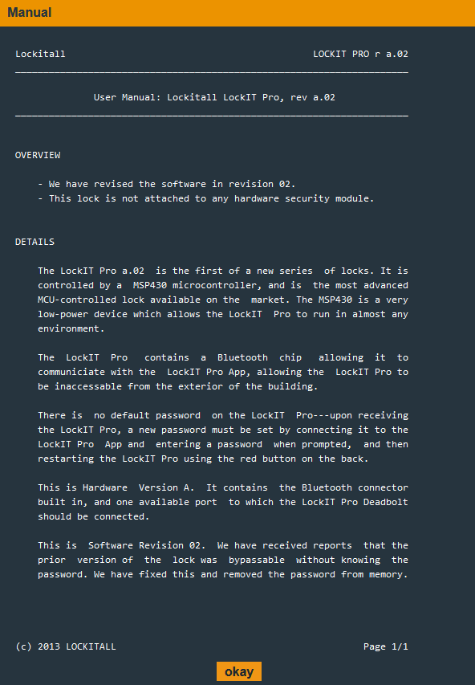

# Microcorruption Level #2 - Sidney
Upon starting the second level we are greeted with another info popup:

#### First Steps
Giving the disassembly window a quick scroll through we can see a function named 'check_password', we can assume this function holds some importance to us. So let's set a breakpoint at main and take a look. It is possible that the function that gets called before, 'get_password', may contain something that we need, but since we haven't seen anything like that yet I'm going straight to 'check_password'.

#### <main>

We can see that main asks the user to enter their password and calls 'puts' to display the message. After a call to 'get_password', 'check_password' gets called. 
  
#### <check_password>
  
  
  'check_password' starts with a compare of 0x516f and r15 with an offset of 0x0. r15 currently points to out input in memory. After that is a 'jnz' instruction that causes us to exit the function. After returning to 'main' we can see a message informing us that we entered the wrong password get printed and we are forced to reset and try again.
  
  On round 2 we'll enter the hardcoded value from 'check_password' and see if that is the correct password. After entering the value '0x516f' we are still kicked out and informed that it was the wrong password. Even though we entered the hardcoded value we still couldn't get past the 'jnz' instruction, why is that? After reading some documentation on the MSP430 I learned that it utilizes little-endian format. Since the value 0x516f is in big-endian format we have to change our input to big-endian.
  
  After changing our input to big-endian we are able to make it past the 'jnz' instruction! Since the function has multiple hardcoded value comparisons, let's enter each of those values in little-endian format. The function performs each compare with an offset increased by two each time. So the value we should input would be: '6f51793859344c24'. We are greeted with the message 'Access Granted!' after entering the password!
  
  The following message is shown when solving with the little-endian format password:
  
  
  
  
  
    
